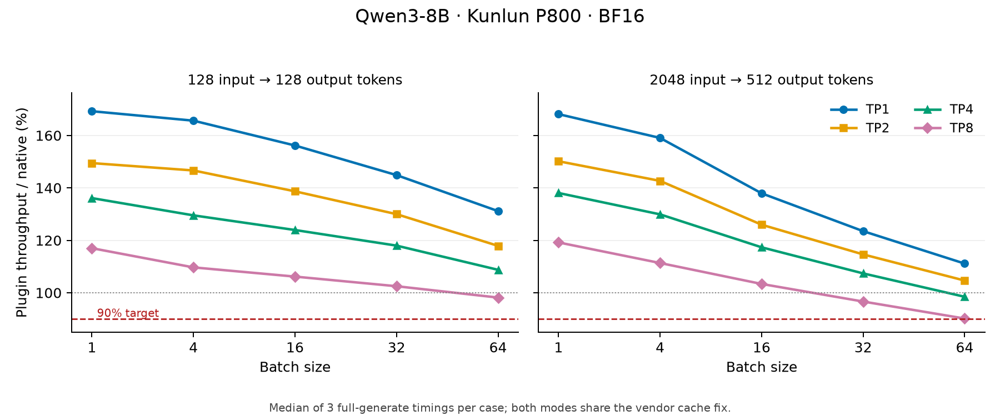

# Kunlun 精度与吞吐实验

日期：2026 年 10 月 10 日（Asia/Shanghai）。机器：`ssh kunlun`，8 张 Kunlun P800 OAM，每卡 96 GiB。

精度与静态吞吐均达到本次验收目标。Qwen3-0.6B、TP1 的 GSM8K 全量 1319 题中，原生与最终插件均为 **715/1319（54.2077%）**，差距 **0pp**。Qwen3-8B 的 TP1/2/4/8 共 **40/40 个静态吞吐配置**达到原生的 90% 以上；InfiniCore Attention 计算调用为 0。

| TP | 最低比例 | 最高比例 | 几何平均比例 | 达标配置 |
| --- | --- | --- | --- | --- |
| 1 | 111.12% | 169.24% | 145.35% | 10/10 |
| 2 | 104.65% | 150.16% | 131.17% | 10/10 |
| 4 | 98.47% | 138.05% | 120.09% | 10/10 |
| 8 | 90.17% | 119.19% | 105.06% | 10/10 |

原生基线与插件均包含下述厂商 KV cache 修复；插件实际启用五条已支持路由，RMSNorm、SiluAndMul 与 Attention 计算沿用厂商实现。最终插件的 40 个配置全部重测；TP1/2/4 原生基线复用同环境的完整初轮测量，TP8 原生与插件完整矩阵重新相邻测量。



## 精度标定

| 模式 | 正确题数 | 得分 | 无可解析答案 | 达到生成长度上限 |
| --- | --- | --- | --- | --- |
| 修复厂商 cache 后的原生 | 715/1319 | 54.2077% | 137 | 5 |
| InfiniCore 插件 | 715/1319 | 54.2077% | 135 | 4 |

两边使用同一份冻结的 GSM8K main/test、Qwen3-0.6B 权重、聊天模板与输入 token。参数为 BF16、0-shot、关闭 thinking、贪心解码、seed=0、batch=16、max_tokens=2048、max_model_len=4096、max_num_batched_tokens=8192、block_size=128、memory=0.30、eager；均使用 1 号卡。

评分按显式最终答案做数值精确匹配，数据 SHA256 为 `7f579d1a33e9b2703633348ed4e0a1ea81ced9cc45137b989740b3b8e279bc44`。全部 1319 条预测均已逐题核对输入、gold、评分、token 数和结束原因。593 题的完整输出 token 数组相同；两种模式各有 56 题仅本模式答对，得分差为 0pp。

插件实际调用 Embedding、MatMul、RoPE、LMHead、StoreKVCache 五条路由。RMSNorm、SiluAndMul 和 Attention 计算由厂商实现。InfiniCore Attention 计算调用为 0，没有所请求路由的原生回退。

最终干净构建完整重跑了插件的 1319 题，全部回答 token 数组与初始插件标定逐题一致，重新完成路由和回退验证，原始结果为 `completed=true`、`errors=[]`。最终插件生成时间为 1844.86 秒；原生完整结果复用冻结的初次测量，文件与 SHA256 记录在 `gsm8k-final/native-reuse-provenance.json`。eager 精度标定用于检查得分，性能验收使用下述 Qwen3-8B Graph 静态吞吐。

初次评测的末尾验证器将 `native_attention_calls` 全部当作回退，误拒绝按要求保留的原生 Attention。修正验证器后，重新核对已有的全部预测与最终 worker 状态；保留原始失败 JSON，新的结果记录原文件指纹、原验证错误和新验证器指纹。此修正没有重新生成回答或修改评分。

## 初轮与 RoPE 优化

初轮 TP1/2/4 的最低比例为 109.42% / 103.24% / 97.21%，均通过；TP8 的最低比例为 89.43%，仅 9/10 项通过。各 TP 的最低配置均为 2048→512、batch 64；原始日志和全部计时保留在 `throughput-initial-tp1-v2`、`throughput-tp-embedding`。

RoPE 优化候选先对最差项单独成对复测，得到 90.71%；随后最终干净构建重跑全量精度和完整吞吐矩阵。本次最终 TP8 最差项为原生 **2413.61 TPS**、插件 **2176.26 TPS**，比例 **90.17%**。插件三次样本为 **2176.26 / 2180.80 / 2174.15 TPS**，均超过本次 90% 阈值 **2172.25 TPS**；中位数仅高出验收比例约 **0.17pp**。

## 厂商 cache 修复

实验所用 `kunlun_ops 0.1.58+ee39020a` 的 Flash BHLD cache 写入在长 prefill 上损坏 V，K 正常。CPU 独立对照中，2048 tokens 的 V 只有约 21.4% 元素正确；原生 batch=16 的初始小样本输出也出现乱码和截断。

同一厂商包的公开 `store_paged_kv_cache` 在 BHLD 上与 CPU 参考一致，因此仅在本次独立环境中将非量化 BHLD 路径切换到该实现。原生与插件共用同一环境修复；上述原生基线包含该修复。可通过 [校验与修复脚本](../../scripts/fix_kunlun_vendor_cache.py) 复现，脚本保留原文件并拒绝未知源码指纹。

| `_cache.py` | SHA256 |
| --- | --- |
| 厂商原文件 | `27bd11cd623d942d4ec2bea2e4feea0411cd8bc08b06f54a35b8d509734628ca` |
| 实验修复后 | `fe8437d8133da80a8ac0760d1000c44b47b6ac1edf2afc982eb5cba11da74bc3` |

## 构建与算子证据

Kunlun legacy 源码锁定为 InfiniCore `a81b18fe6d88f835b35e34801300966741ff423f`，包含 Kunlun PagedCaching 和 BF16 单 token GEMM 修复。旧提交的部分 skinny GEMM 每步重转 FP32 权重，标定无法在合理时间内完成，故采用已合入上游的 BF16 Lt 路径。

[构建入口](../../scripts/build_kunlun.py) 在独立源码副本中应用 [兼容补丁](../../scripts/patches/kunlun/README.md)，处理未使用的 Boost 依赖、spdlog 与 HydraLog 符号冲突、禁用 CPU 构建时的上下文初始化，以及厂商 XBLAS 头文件优先级。构建与 SDK 路径、补丁和四个动态库的 SHA256 写入 `install/manifest.json`。

- 标定库与干净可复现构建的 30 组算子输出 hash 完全一致。
- KV 和 RoPE 在 1/16/128/512/2048 tokens 上与 CPU 参考一致；RoPE Q/K 与厂商实现逐元素一致。
- 五条路由在 Graph 捕获后改变输入、位置及 KV slot，两次重放的结果均与重新计算一致，覆盖 batch=1/4/16/64。
- Qwen3-8B 的 GEMM / LMHead 及 TP1/2/4/8 分片尺寸共 40 组 CPU 对照通过，相对 L2 误差小于 0.001。

## 吞吐协议与材料

静态吞吐使用 Qwen3-8B BF16，长度为 128→128、2048→512，batch=1/4/16/32/64。每项预热一次，计时三次并取输出 TPS 中位数；计时包含完整 generate 的 prefill，排除初始化、编译和 Graph 捕获。max_model_len=2816、max_num_seqs=64、max_num_batched_tokens=8192、block_size=128；memory 在 TP1/2 为 0.85、TP4/8 为 0.70。

[测试入口](../../vllm_infinicore/benchmarks/kunlun_static.py) 保存逐次计时、输出 hash、环境、版本和动态库指纹，核对每个 rank 的实际路由与 Graph capture/replay。成对比较要求输入、参数、版本、设备和厂商 cache 指纹相同，并逐配置报告是否达到原生的 90%。

TP1 的原生与插件各完成 30 个计时样本。每种模式捕获 14 个 Graph，正式请求期间实际重放 12,764 次；五条路由实际调用，InfiniCore Attention 计算与意外回退均为 0。默认捕获模式为 PIECEWISE prefill 和 FULL decode。

后续 TP2/4/8 使用 [TP Embedding 适配](../../vllm_infinicore/routing/routes/embedding.py)：复用 vLLM 的本地分片索引、mask 和 all-reduce，允许 legacy C++ lookup 处理本地权重；保留 legacy Python API 的历史限制。该思路沿用 MetaX 适配，避免多卡已注册 Embedding 却实际绕回原生。

RoPE 借鉴 Ascend 的并行化思路，并针对 P800 验证两个分解因素。单独交错 cluster 任务编号，对大 prefill 没有可测收益；SDK 查询确认设备有 12 个 cluster，将固定 8 个改为 12 个后，8192-token Q/K RoPE 微基准加速约 1.45～1.49 倍。进一步将每层位置 cast / clamp 合入 RoPE，TP8、64-token Q/K 的 Graph 延迟由约 16.98μs 降为 11.81μs。

最终候选按设备实际 cluster 数启动，上限为 12；通过库能力位启用原生 I32 / I64 位置及内核裁剪。24 组 TP 分片尺寸的 CPU 与动态 Graph 输出 hash 和原实现一致；BF16 / FP16 / FP32、I32 / I64、NeoX / GPT-J、packed Q/K stride 及负数/越界位置的 24 项检查也与旧库输出 hash 完全一致。旧库能力位为 false，预处理兼容路径通过验证。

最差配置的候选复测为原生 **2406.04 TPS**、插件 **2182.56 TPS**，比例 **90.71%**，各预热一次并计时三次。该单项复测用于确认优化方向，不代替最终完整矩阵。

## 完整吞吐矩阵

单位为输出 tokens/s，比例按未舍入的中位数计算。每行对应三次原生和三次插件计时；所有原始样本均保留，包括较慢样本。

| TP | 输入→输出 | Batch | 原生 TPS | 插件 TPS | 比例 |
| --- | --- | --- | --- | --- | --- |
| 1 | 128→128 | 1 | 25.26 | 42.76 | 169.24% |
| 1 | 128→128 | 4 | 98.76 | 163.57 | 165.64% |
| 1 | 128→128 | 16 | 366.59 | 572.49 | 156.17% |
| 1 | 128→128 | 32 | 669.18 | 969.48 | 144.88% |
| 1 | 128→128 | 64 | 1153.13 | 1512.30 | 131.15% |
| 1 | 2048→512 | 1 | 24.74 | 41.60 | 168.13% |
| 1 | 2048→512 | 4 | 92.03 | 146.37 | 159.05% |
| 1 | 2048→512 | 16 | 290.80 | 401.09 | 137.93% |
| 1 | 2048→512 | 32 | 454.08 | 560.77 | 123.50% |
| 1 | 2048→512 | 64 | 637.67 | 708.61 | 111.12% |
| 2 | 128→128 | 1 | 43.50 | 65.02 | 149.45% |
| 2 | 128→128 | 4 | 167.25 | 245.27 | 146.64% |
| 2 | 128→128 | 16 | 603.10 | 836.39 | 138.68% |
| 2 | 128→128 | 32 | 1077.41 | 1400.47 | 129.98% |
| 2 | 128→128 | 64 | 1779.06 | 2097.31 | 117.89% |
| 2 | 2048→512 | 1 | 42.17 | 63.31 | 150.16% |
| 2 | 2048→512 | 4 | 154.20 | 220.00 | 142.67% |
| 2 | 2048→512 | 16 | 474.00 | 597.01 | 125.95% |
| 2 | 2048→512 | 32 | 733.28 | 840.55 | 114.63% |
| 2 | 2048→512 | 64 | 1002.56 | 1049.22 | 104.65% |
| 4 | 128→128 | 1 | 72.12 | 98.16 | 136.10% |
| 4 | 128→128 | 4 | 256.68 | 332.45 | 129.52% |
| 4 | 128→128 | 16 | 923.66 | 1144.72 | 123.93% |
| 4 | 128→128 | 32 | 1675.25 | 1976.50 | 117.98% |
| 4 | 128→128 | 64 | 2830.75 | 3078.56 | 108.75% |
| 4 | 2048→512 | 1 | 69.70 | 96.23 | 138.05% |
| 4 | 2048→512 | 4 | 241.42 | 313.61 | 129.90% |
| 4 | 2048→512 | 16 | 764.75 | 897.32 | 117.33% |
| 4 | 2048→512 | 32 | 1220.13 | 1310.24 | 107.39% |
| 4 | 2048→512 | 64 | 1751.55 | 1724.67 | 98.47% |
| 8 | 128→128 | 1 | 103.86 | 121.51 | 117.00% |
| 8 | 128→128 | 4 | 319.52 | 350.45 | 109.68% |
| 8 | 128→128 | 16 | 1142.50 | 1212.94 | 106.17% |
| 8 | 128→128 | 32 | 2086.20 | 2138.26 | 102.50% |
| 8 | 128→128 | 64 | 3540.77 | 3475.88 | 98.17% |
| 8 | 2048→512 | 1 | 99.81 | 118.97 | 119.19% |
| 8 | 2048→512 | 4 | 301.86 | 336.11 | 111.35% |
| 8 | 2048→512 | 16 | 978.09 | 1010.97 | 103.36% |
| 8 | 2048→512 | 32 | 1631.10 | 1576.48 | 96.65% |
| 8 | 2048→512 | 64 | 2413.61 | 2176.26 | 90.17% |

40 个配置共保留 **240 次正式计时**（120 次原生、120 次插件；其中 TP1/2/4 的 90 次原生计时来自初轮）。每个模式、每个 rank 均捕获 14 个 Graph，重放 12,764 次；最终插件的所有 rank 均实际调用五条请求路由，没有意外回退，InfiniCore Attention 计算调用为 0。

| TP | 原生测量时间（UTC+8） | 最终插件测量时间（UTC+8） | 原生来源 |
| --- | --- | --- | --- |
| 1 | 11:36:20～11:49:28 | 13:50:35～14:00:47 | 初轮冻结结果 |
| 2 | 12:00:09～12:08:27 | 14:00:49～14:07:51 | 初轮冻结结果 |
| 4 | 12:15:51～12:21:08 | 14:07:53～14:12:41 | 初轮冻结结果 |
| 8 | 14:12:44～14:16:54 | 14:16:57～14:21:10 | 本轮重测 |

复用文件的原路径和 SHA256 位于 `throughput-final/native-reuse-provenance.json`。比较器重新核对版本、模型配置、输入 token hash、设备映射、参数、厂商 cache 指纹，以及每个 rank 的路由和 Graph 证据；复用期间厂商代码、权重和这些条件保持相同。

完整请求输出 token hash 相同的数量依次为 TP1 **689/702**、TP2 **689/702**、TP4 **102/702**、TP8 **54/702**。保存的 Qwen3-8B 生成文本样例可读，完整输出不逐请求全部相同；BF16 GEMM 与多卡归约的数值差异可能改变贪心解码，这是对已测算子误差和输出的解释。GSM8K 精度验证对象为 Qwen3-0.6B / TP1；Qwen3-8B 各 TP 的数据用于静态吞吐验收。

在已配置的 xpytorch 环境中，使用新的输出目录复现全量精度和 TP8 矩阵：

```sh
export VLLM_PLUGINS=kunlun,kunlun_model
export VLLM_INFINICORE_OPERATOR_BACKEND=kunlun
export INFINI_ROOT=/path/to/kunlun-build/install
export LD_LIBRARY_PATH="$INFINI_ROOT/lib:$LD_LIBRARY_PATH"
export XMLIR_FORCE_USE_XPU_GRAPH=1 XMLIR_ENABLE_MOCK_TORCH_COMPILE=false
export VLLM_USE_V1=1 VLLM_ENABLE_V1_MULTIPROCESSING=0 USE_ORI_ROPE=1
export XPU_VISIBLE_DEVICES=1 CUDA_VISIBLE_DEVICES=1
python -m vllm_infinicore.benchmarks.gsm8k --platform kunlun --mode both \
  --model /path/to/Qwen3-0.6B --dataset-file /path/to/dataset.json \
  --output-dir results/kunlun-gsm8k-fresh --batch-size 16 --max-tokens 2048 \
  --max-model-len 4096 --max-num-batched-tokens 8192 --memory 0.30 --enforce-eager
python -m vllm_infinicore.benchmarks.kunlun_static --mode native \
  --model /path/to/Qwen3-8B --tp 8 --devices 0,1,2,3,4,5,6,7 \
  --output results/kunlun-tp8-fresh/native.json
python -m vllm_infinicore.benchmarks.kunlun_static --mode infinicore \
  --model /path/to/Qwen3-8B --tp 8 --devices 0,1,2,3,4,5,6,7 \
  --output results/kunlun-tp8-fresh/infinicore.json
python -m vllm_infinicore.benchmarks.kunlun_static \
  --compare-native results/kunlun-tp8-fresh/native.json \
  --compare-infinicore results/kunlun-tp8-fresh/infinicore.json \
  --output results/kunlun-tp8-fresh/comparison.json
```

TP1/2/4 分别指定 `--tp 1/2/4`、`--devices 0/0,1/0,1,2,3`，并各用新的输出目录。正式吞吐测试按模式与 TP 串行运行，避免其他实验占用设备或编译资源。

运行环境为 PyTorch 2.5.1+cu118 / xpytorch、vLLM 0.11.0、vllm-kunlun 0.11.0、kunlun_ops 0.1.58+ee39020a，驱动 5.0.21.26。厂商要求的 Dynamo `eval_frame.py` 补丁仅应用在本实验的独立 PyTorch 副本中，公共环境保持原状。原生全量 GSM8K 在创建该副本前运行；1875 个 Python 文件核对后仅此文件的 import 位置不同，`libtorch_cpu`、`libtorch_cuda`、`libc10`、`libc10_cuda` 的二进制 SHA256 均相同。eager 标定的数值运行时保持相同，证据见 `provenance/final-runtime-provenance.json`。

服务器实验根目录：`/workspace/work/infinicore-kunlun-20261010`。本地副本：`results/kunlun-optimization-20261010/`，受 `.gitignore` 保护。

- `gsm8k-calibrated-comparison`：两份全量预测、得分、对比及原始验证失败记录。
- `build-kunlun-reproducible/install`：可复现构建库与 manifest。
- `logs` / 本地 `provenance`：算子、Graph、模型权重、环境和 SDK 指纹。
- `throughput-initial-tp1-v2`：完整 TP1 成对吞吐。
- `throughput-tp-embedding`：完整初轮 TP2/4/8 成对吞吐，保留 TP8 的未达标结果。
- `rope-striped-probe` / `rope-clusters12-probe` / `rope-native-positions-probe`：RoPE 分解微基准、源码及正确性记录。
- `throughput-rope-positions-worst`：最差配置的候选成对复测。
- `gsm8k-final`：最终干净构建的完整精度结果及原生复用指纹。
- `throughput-final`：最终 TP1/2/4/8 的完整成对矩阵、逐次计时、输出 hash、worker 证据及原生复用指纹。
- `verified-summary.json`：逐题评分、40 项阈值及动态库指纹重新校验后的汇总，包含材料 SHA256。
- `throughput-ratios.png` / `throughput-ratios.svg`：由完整矩阵生成的静态图表。
- `build-kunlun-final/install`：本次最终安装库与含两项补丁的 manifest。
